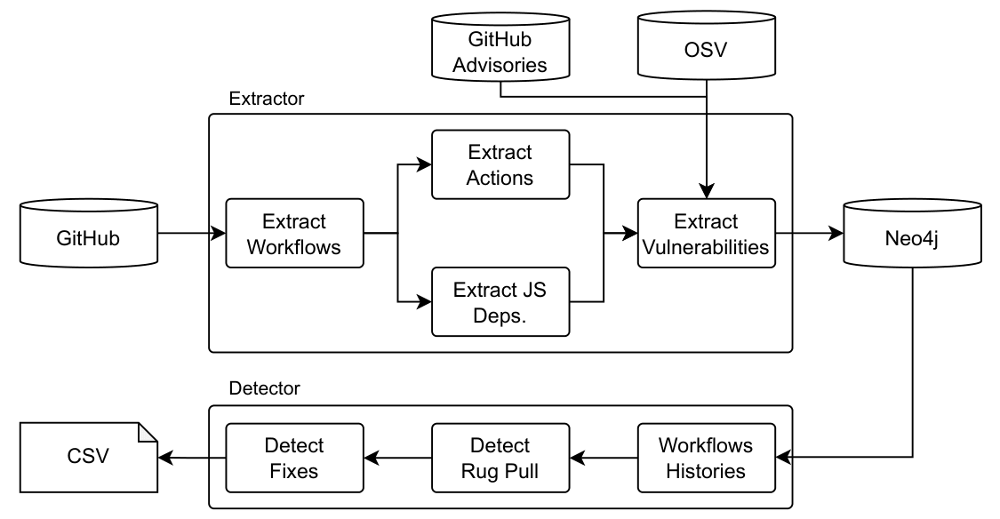

# rug-pulled

## Requirements

### Dataset

To correctly display the statistics and Gantt charts, make sure that there is a populated `data/` directory at the root of the repository. If you are downloading this repository from [Figshare](https://doi.org/10.6084/m9.figshare.30734789), then you can skip this step, since the `data/` directory is already provided. However, if you have downloaded this repository from GitHub, you will need to download the `data/` directory by navigating to [Figshare](https://doi.org/10.6084/m9.figshare.30734789) and downloading the `data.zip` archive. Once downloaded, extract it in the root of this repository.

```
rug-pulled
├── data
│   ├── repositories
│   │   └── *.pickle
│   ├── actions.csv
│   ├── actions_versions.csv
│   ├── commit_dates.csv
│   ├── commits.json
│   ├── dataset.csv
│   ├── dataset_stats.csv
│   ├── rug_pulls.csv
│   └── workflows.json
└── ...
```

The structure of the `data/` directory should look as above. The directory `data/repositories` contains the pickled versions of the repositories' objects. The structure of these objects is defined in `src/models/neo.py`. The other `json` and `csv` files contain data that is necessary for calculating some of the statistics and plots.

The data was created by using the methods contained in `src/scripts.py`. To use the scripts, you should also have a Neo4j and MongoDB databases running, together with the Kleio crawler. To know how to set it up, please refer to the `INSTALL.md` file in the root of this repository.

## Data Flow

The following figure describes the dataflow of both Kleio and the webapp used to display the results (`aegis-forge/kleio` contains detailed documentation of its architecture, as well as neo4j and mongodb structures).



The extraction part of the flow is carried out by Kleio itself. The data extracted from the workflows, components (GHAs), and vulnerabilities is then saved in a Neo4j database.

The second part of the flow, namely the detector, is carried out by the scripts contained in this webapp. For convenience and replicability purposes, we already provide the CSV files produced by the scripts. Such files can be found in the `data/` directory. If you are cloning this repository from GitHub, check [Dataset](#dataset).

Finally everything contained in `data/` is used as input by the webapp to display statistics and Gantt charts.

## Publications

This repository serves as the replication package for the following publication:

- Riggio, E. and Pautasso C. (2026). Changing Nothing, Yet Changing Everything: Exploring Rug Pulls in GitHub Workflows. Proceedings of the 23rd IEEE International Conference on Software Architecture (ICSA), IEEE, in press

## Contacts

- Edoardo Riggio - [https://edoriggio.com](https://edoriggio.com)
